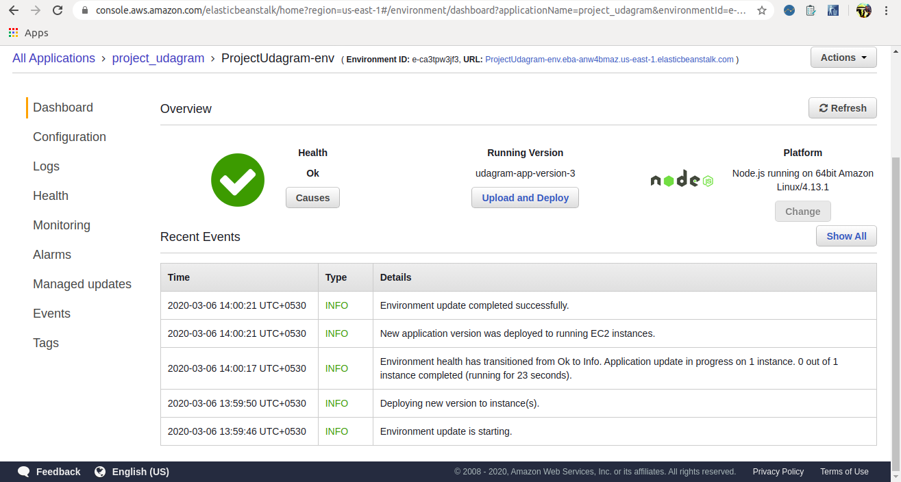

# Full Stack App Using AWS

## Udagram Monolith - FullStack App on AWS

#### Repository Link : https://github.com/SwarnadeepGhosh/Full-Stack-App-Using-AWS

[AWS site link](http://projectudagram-env.eba-anw4bmaz.us-east-1.elasticbeanstalk.com/) 

[Filtered image example](http://projectudagram-env.eba-anw4bmaz.us-east-1.elasticbeanstalk.com/filteredimage?image_url=https://www.w3schools.com/w3css/img_lights.jpg)

###### Screenshots of deployment on AWS Elastic beanstalk :

## Credits 
- [Udacity](https://www.udacity.com/)
- [Amazon Web Services](https://aws.amazon.com/)
'.''
 
